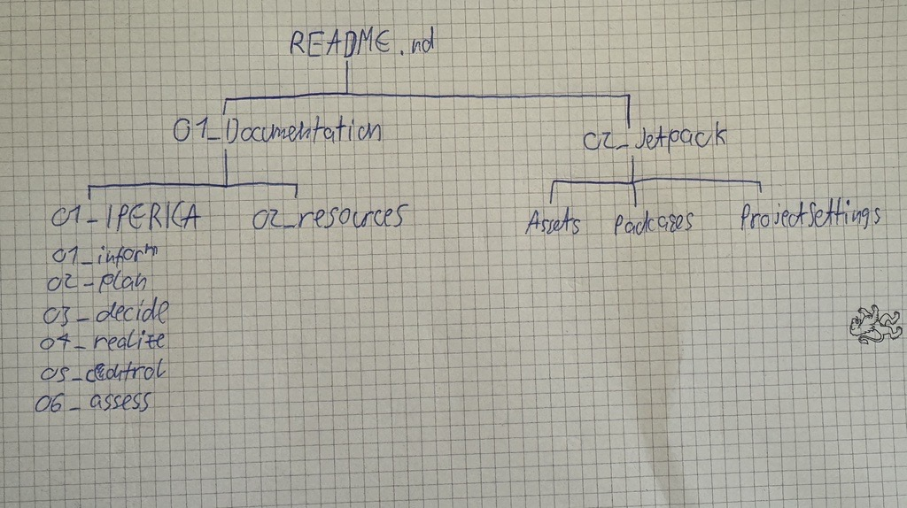

# Design

# Order
1. Define the naming conventions
1. Design the Github directory structure
1. Design the game 
1. Design testcases

# Naming conventions

**scripts in Unity**

- every word begins uppercase
- no spaces

**sprites in Unity**

- all lowercase
- no spaces

# Github directory structure

- made a simple sketch of how the directory should look like

  

