# Realize

# Design

# Order
1. Define the naming conventions
1. Design the Github directory structure
1. Design the game 

# Naming conventions

**scripts in Unity**

- every word begins uppercase
- no spaces

**sprites in Unity**

- all lowercase
- no spaces

# Github directory structure

- made a simple sketch of how the directory should look like

  

# Game-Design

## sketches

- made a sketch of how the character should look like

 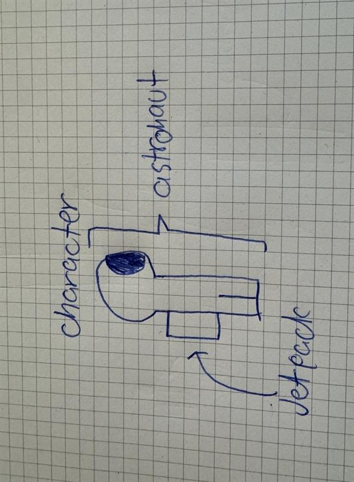

 - made a sketch of the obstacles

 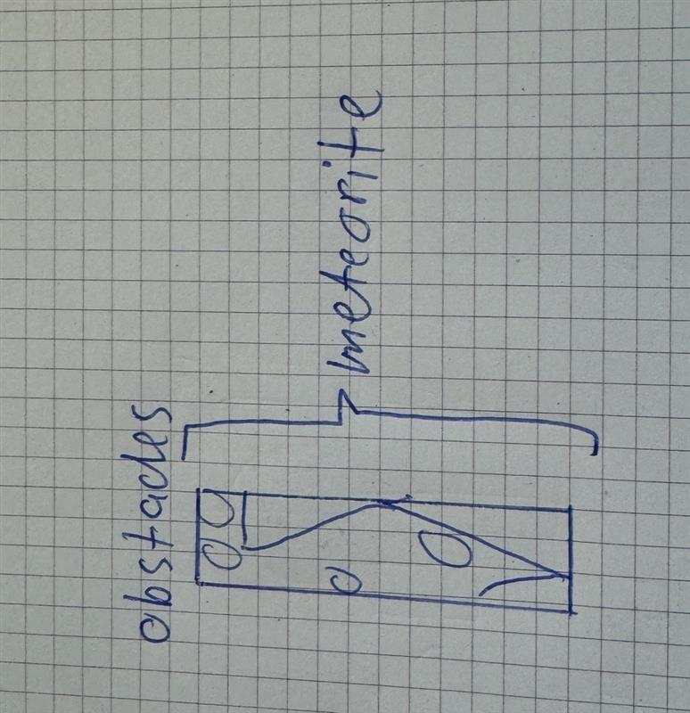

 - made a sketch of how the game should look like when being played

  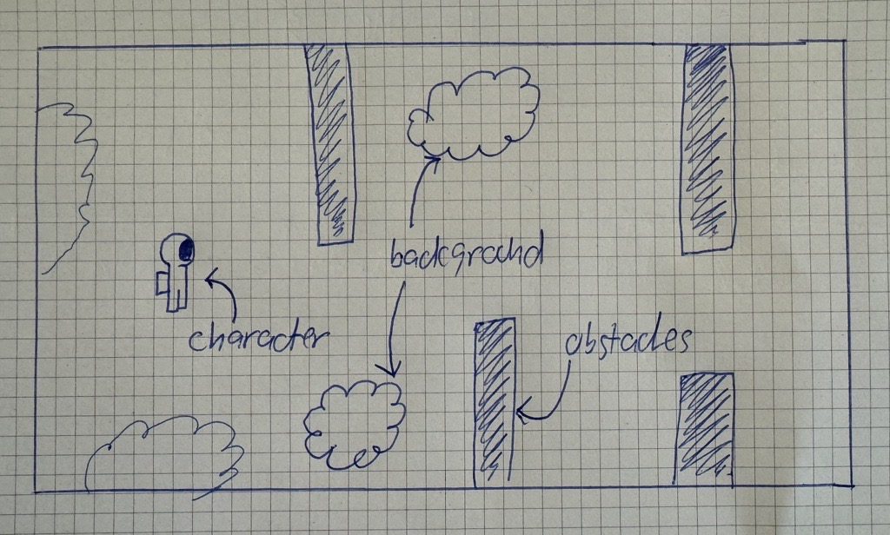

  ## final version

  - final version of the character design

     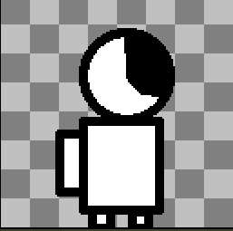

- final version of the obstacles design

     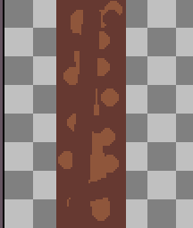

- final version of the game-design

    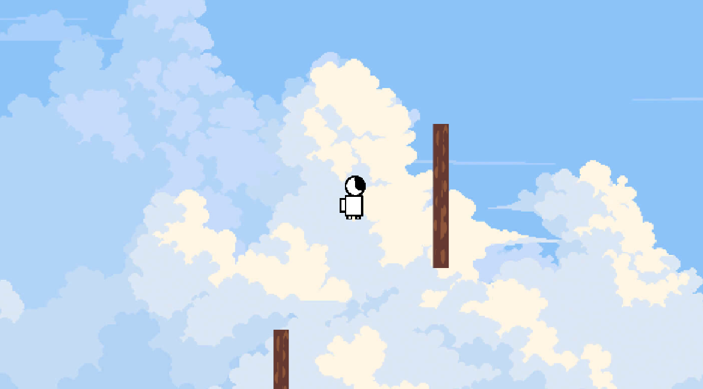

  # Setup

  # Order
1. Create Github directory structure
1. Install Github Desktop
1. install Unity
1. install Aseprite

# Create Gtihub directory structure

- created the directory structure in the Website itself

# Install Github Desktop
- installed Github Desktop so we can commit and push our project from Unity
- cloned the repository from github into my desktop with Github Desktop

## How to clone repository with Github Desktop

- overview of Github Desktop

   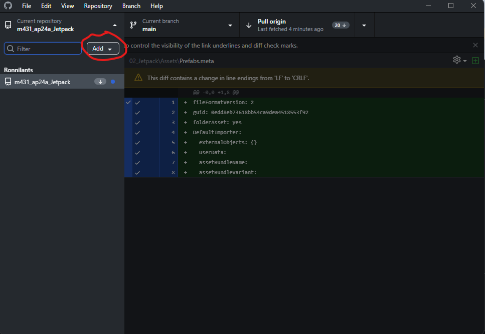

- clone the repository

   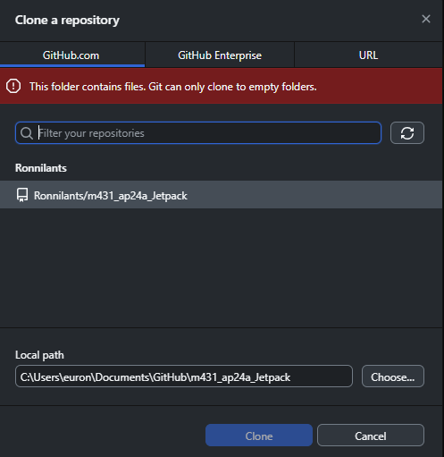

  # Install Unity
  - installed Unity because its the game engine that we use
  - created the project

  ## How to create a project in Unity

  - overview of Unity, create project

     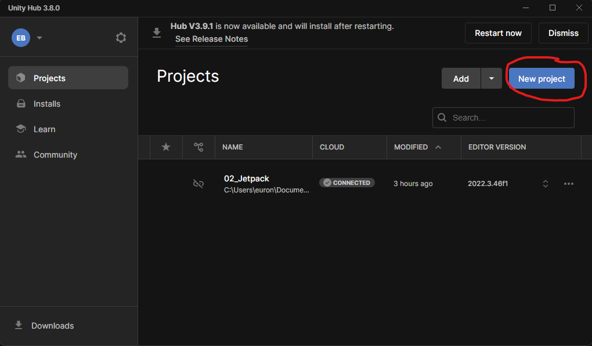

  - make it a 2D project

    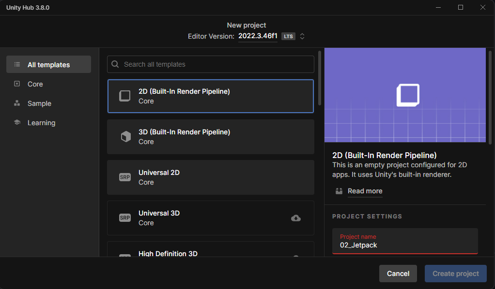

  - remaining configuration of the project 

  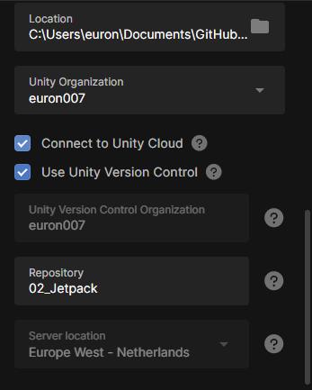

  # Install Aseprite
  - installed it from steam
  - used it to design the characters and obstacles
  - costs CHF 19.50 but was bought for private use before the project

  ## How to create and configure a file in aseprite

  - aseprite in the steam library
 
     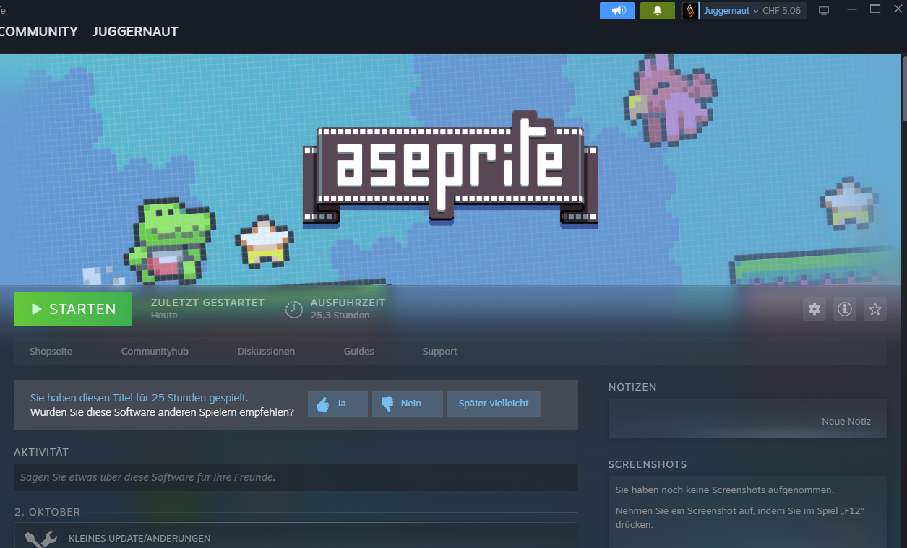

  - overview of aseprite
 
     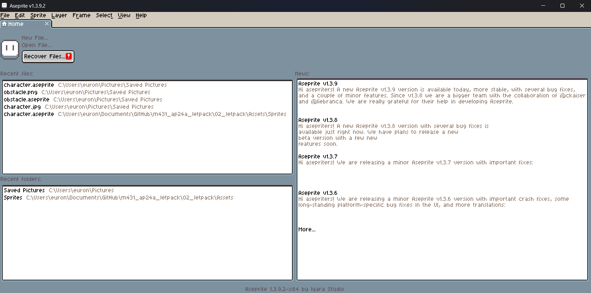

  - create the file
    
     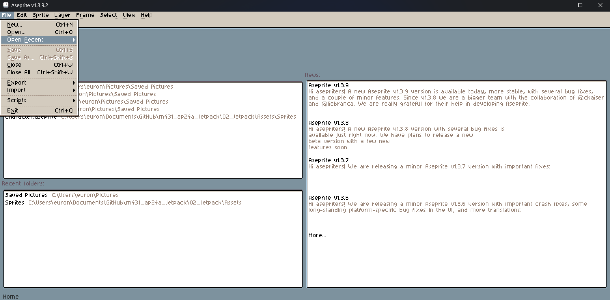

- configure the file (size 128x128 pixels, color mode AGEA , background transparent)

     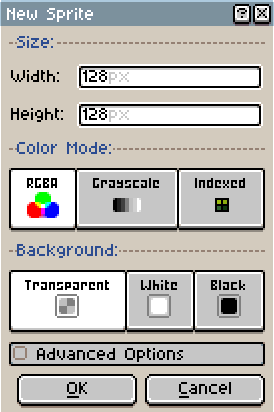

  # Implement

  # Order

- Implement the background
- Implement the character
  - Scripts
- Implement the obstacles
  - Scripts
  

