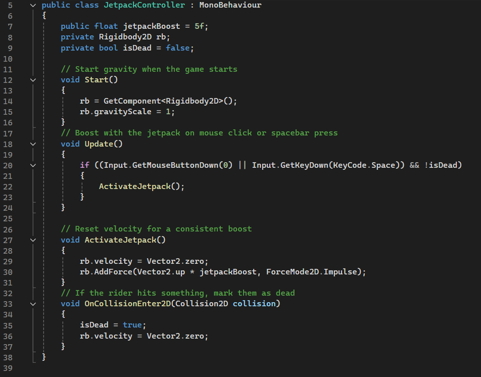

# Realize

# Design

# Order
1. Define the naming conventions
1. Design the Github directory structure
1. Design the game 

# Naming conventions

**scripts in Unity**

- every word begins uppercase
- no spaces

**sprites in Unity**

- all lowercase
- no spaces

# Github directory structure

- made a simple sketch of how the directory should look like

  

# Game-Design

## sketches

- made a sketch of how the character should look like

 

 - made a sketch of the obstacles

 

 - made a sketch of how the game should look like when being played

  

  ## final version

  - final version of the character design

     

- final version of the obstacles design

     

- final version of the game-design

    

  # Setup

  # Order
1. Create Github directory structure
1. Install Github Desktop
1. install Unity
1. install Aseprite
2. Donwloads

# Create Gtihub directory structure

- created the directory structure in the Website itself with the sketch shown in the design part

# Install Github Desktop
- installed Github Desktop so we can commit and push our project from Unity
- cloned the repository from github into my desktop with Github Desktop

## How to clone repository with Github Desktop

- overview of Github Desktop

   

- clone the repository

   

  # Install Unity
  - installed Unity because its the game engine that we use
  - created the project

  ## How to create a project in Unity

  - overview of Unity, create project

     

  - make it a 2D project

    

  - remaining configuration of the project 

  

  # Install Aseprite
  - installed it from steam
  - used it to design the characters and obstacles
  - costs CHF 19.50 but was bought for private use before the project

  ## How to create and configure a file in aseprite

  - aseprite in the steam library
 
     

  - overview of aseprite
 
     

  - create the file
    
     

- configure the file (size 128x128 pixels, color mode AGEA , background transparent)

     

  # Downloads
  - [Unity](https://unity.com/de/download)
  - [Github Desktop](https://desktop.github.com/download/)
  - [Aseprite](https://www.aseprite.org/download/)

  # Implement

  # Order

- Implement the background
- Create scripts
- Implement the character
  - JetpackController
- Implement the obstacles
  - ObstacleController
  - ObstacleSpawner

  # Implement the background
- add the file in Unity so I can use it in the game by draging the file in to the sprites folder
 
- add the file in the game by draging the file to the scene
   
  - added the background because it schould give the user a better understanding of the game
# Create scripts
1. created the scripts folder (same way as C# scripts)
2. pressed on the "+" button
  - 
3. chose C# script
 -  
4. named it
  - 
    
  # Implement the character
  - add the file like the backround to the unity by draging the file to the sprites folder
  - add the file (JetpackRider) in the game by draging the file to the main camera
  - 
  ## JetpackController
- this script is used for the movement of the character and the control of the character
- add the script to the character by draging it to the JetpackRider
  
  # Implement the obstacles
- two files, ObstacleBottom and ObstacleTop
- the obstacles had to be prefabs so that when I spawn and delete them while playing theay still are saved
- made them prefabs by creating a prefabs folder and adding them to the folder, by draging the files in to the folder
  
  ## ObstacleController
- this script is used for the movement of the obstacles
- added the script by draging it to the files
  
  ## ObstacleSpawner
  - this script is used to spawn obstacles at random height (x) positions so it doesnt get boring for the player
  - added the file by draging it to the scene and by choosing ObstacleBottom and ObstacleTop as game objects
 

