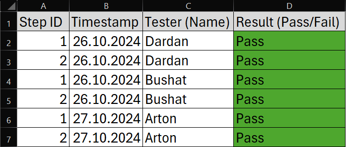

# Control

# How i checked and controlled this assignment

# Order

1. Desgin testcases and testprotocol
3. Code Review
4. Requirement and Documentation review
5. Test summary

# Design testcases and testprotocol

- For the testing we used UAT (User Acceptance Testing), because we only test the UX (User Experience) and we don't have a Website that includes a backend
- Our game is very small and only has a few scripts
- The two functions that we had to test were the controls and the hitbox of the obstacles and what happens if the character collides with the obstacle
- We made two testcases and a testprotocol
- The game was tested by Euron's relatives

## Testcases

- Testcases for the game

  

## Testprotocol

- Testprotocol with the resutlts from each person (including name and timestamp)

# Code Review

- The Code was tested by a relative of Euron that works as a consultant and has some experience in C#
- ****Positive feedback****
  - He told us that our code looks clean and it's good that we used multiple scripts
- ****negative feedback****
  - naming conventions: What we had to change were the names of the scripts because they were unnecessarily complicated

# Requirement and Docoumentation review

# Test summary

